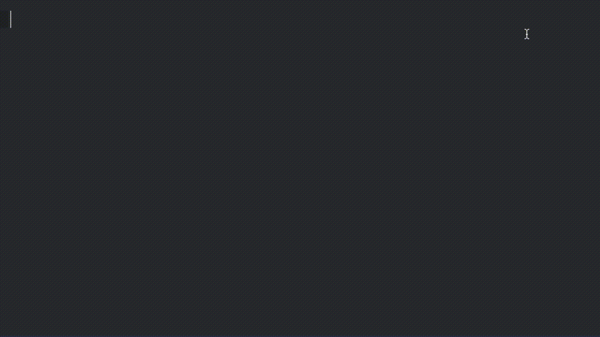

# GameMaker Language (GML) Bundle for Sublime

<!--  -->

## Features
 - Syntax Highlighting
 - Keywords/Built-In Variables Autocompletion
 - User-created Resources Autocompletion
 - Function/Control Snippets
 - Auto Indentation
 - Create new script through Sublime (Beta)

## Installation

Using [Sublime Package Control](http://wbond.net/sublime_packages/package_control):

    Command Palette (⌘⇧P)  ➤  Package Control: Install package  ➤  GameMaker Language (GML) Bundle

Restart your Sublime and you're ready to rock!

## Usage
### GameMaker: Studio 2
- [Checkout my tutorial on setting up your GameMaker Studio: 2 for Sublime](http://code.uduse.com/2017/02/10/set-up-your-sublime-text-3-to-write-gamemaker-studio-2-codes/)!
- Name your source file with extension ```gml```. For example, ```example.gml```. Syntax highlighting will be applied automatically. 
- Partially type keywords, built-in variables, and names of user-created resources to trigger autocompletion. To enable user-created resources completions, make sure your project root directory is opened in Sublime.
- Partially type function names to trigger function snippets. If multiple parameters are avaliable, TAB (↹) to go to next one. Most of the built-in functions are avaliable as snippets. 
- Other custom snippets are: ```for```, ```if```, ```else```, ```repeat```, ```switch```, ```while```, ```with```, and ```print``` that writes ```show_debug_message```.
- To indent your gml file, use: ```Command Palette (⌘⇧P)  ➤  Indentation: Reindent Lines.```
- To create a new script, use: ```Command Palette (⌘⇧P)  ➤  GameMaker: New Script```

### GameMaker: Studio 1.4 or earlier:
- You need to copy & paste manually between Sublime and GameMaker: Studio.
- Name your source file with extension ```gmll```, the extra 'l' stands for legacy. For example, ```example.gmll```.
- User-created resources autocompletion is not supported.
- Everything else is pretty much the same as GameMaker: Studio 2.