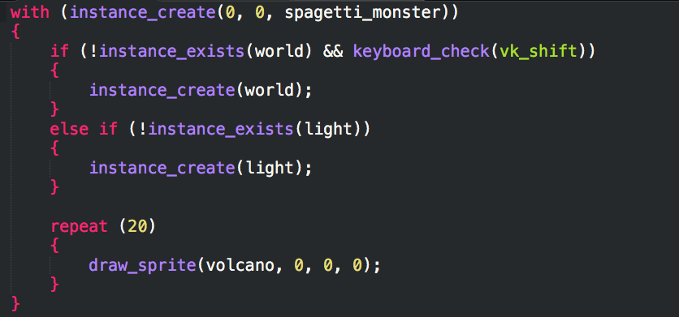

# GameMaker Studio Language Bundle for Sublime



## Features
 - Syntax highlighting
 - Keywords autocompletion
 - Basic control snippets

## Installation

Using [Sublime Package Control](http://wbond.net/sublime_packages/package_control):

    Command Palette (⌘⇧P)  ➤  Package Control: Install package  ➤  GameMaker Language (GML) Bundle

Restart your Sublime and you're ready to rock!

## Usage
Name your script with extension ```gml```. For example, ```nvm.gml```. Syntax highlighting and autocompletion are automatic and snippets can be triggered with their name. Available snippets are: ```for```, ```if```, ```else```, ```repeat```, ```switch```, ```while```, ```with```.